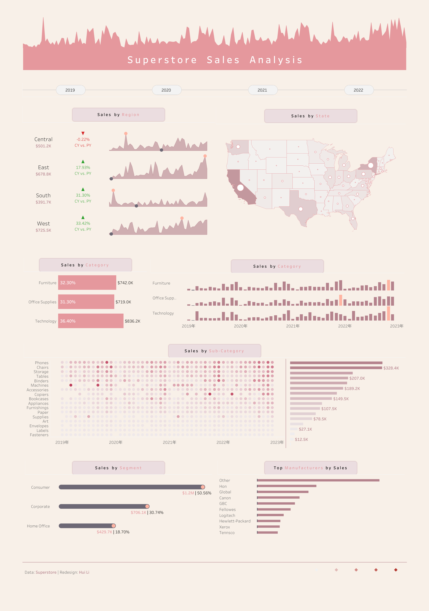

# Sales Analysis Case ✨

## Case Background
As a BI analyst at **Superstore**, you're tasked with leveraging data from the company's operations to drive strategic decision-making. Using the Superstore dataset, you'll:

- Analyze sales performance across regions, states, and product categories  
- Track sales trends over time  
- Identify top manufacturers by sales volume  

Your goal is to provide actionable insights to optimize revenue, operations, and customer satisfaction.  

## Dashboard
[Click here to view the interactive Tableau dashboard](https://public.tableau.com/app/profile/hui.li1478/viz/Superstore_salesanalysis_2/SuperstoreSalesDashboard) 🔗  

## Dashboard Snapshot

---

