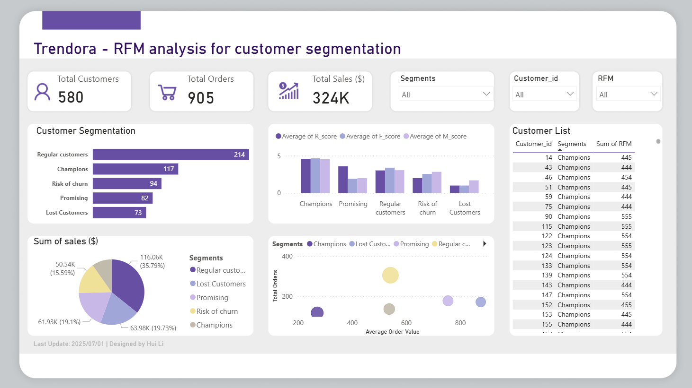

# 🧩 Trendora RFM Customer Segmentation Analysis

## 🛍️ Project Overview
**Trendora** is an European online fashion retailer operating via e-commerce and mobile app channels.  
The goal of this project is to perform **RFM (Recency, Frequency, Monetary)** analysis to segment customers based on their purchasing behaviors and help the marketing team design targeted retention and loyalty strategies.

This project demonstrates my ability to:
- Conduct **data transformation and customer-level aggregation** using SQL and Python  
- Apply **RFM segmentation** to derive behavioral insights  
- Visualize results and segment distribution using Tableau  

---

## 🎯 Business Objective
The marketing department wanted to:
- Identify **high-value and at-risk customers**  
- Support **personalized marketing campaigns** and **retention strategies**  
- Prioritize customer engagement based on behavioral scores  

**Analytical Question:**  
> How can we categorize Trendora’s customers by their purchasing behavior to optimize marketing actions?

---

## 🧭 Problem-Solving Framework (4W1H)

| Question | Description |
|-----------|--------------|
| **Who** | The audience of this report are marketing and CRM managers at Trendora |
| **What** | What do they want to view in this report? Segmented customer groups to identify high-value customers, at-risk customers, and promising customers.
| **Why** | Enable data-informed customer retention and improve marketing ROI |
| **Where** | Across Trendora’s e-commerce and mobile app channels in Europe |
| **How** | Extract and aggregate sales data with SQL, score customers with Python, visualize insights in PowerBI |

---

## 🗂️ Data Source
The dataset simulates an online retailer with multiple relational tables.  
For this RFM analysis, the key tables used were:

| Table | Description |
|--------|--------------|
| **sales** | Order-level data (sale_id, customer_id, sale_date, total_amount) |
| **customers** | Customer demographics (country, age_range, signup_date) |

---

## Dashboard Snapshot

---